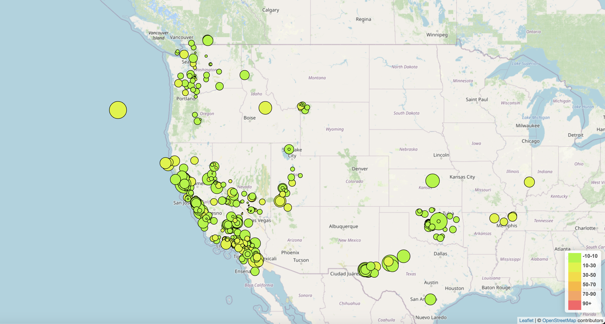

# leaflet-challenge
## Purpose
The United States Geological Survey, or USGS for short, is responsible for providing scientific data about natural hazards, the health of our ecosystems and environment, and the impacts of climate and land-use change. Their scientists develop new methods and tools to supply timely, relevant, and useful information about the Earth and its processes.

The USGS is interested in building a new set of tools that will allow them to visualize their earthquake data. They collect a massive amount of data from all over the world each day, but they lack a meaningful way of displaying it. In this challenge, you have been tasked with developing a way to visualize USGS data that will allow them to better educate the public and other government organizations (and hopefully secure more funding) on issues facing our planet.
## Overview
### Create the Earthquake Visualization
#### Map
- [x] TileLayer loads without error
- [x] Connects to geojson API using D3 without error
- [x] Markers with size corresponding to earthquake magnitude
- [x] A legend showing the depth and their corresponding color
#### Data Points
- [x] Data points scale with magnitude level
- [x] Data points colors change with depth level
- [x] Each point has a tooltip with the Magnitude, the location and depth
- [x] All data points load in the correct locations
## Notes
Started out following the UofMN Data Visualization Week 15 Class 2 Activity 01-Evr_BasicsNYCBororoughs.
Matched colors from the six legend colors from given expected results map using Digital Color Meter https://support.apple.com/guide/digital-color-meter/welcome/mac and RGB to HEX Color Converter https://www.rgbtohex.net/
Referred to UofMN Data Visualization Week 15 Class 2 Activity 04-Par_SchoolDistrictChoropleth for style.css file.
### Data
Tectonic plates data from https://github.com/fraxen/tectonicplates under Open Data Commons Attribution License.
## Results
Part-1 Map

Part-2 Map
